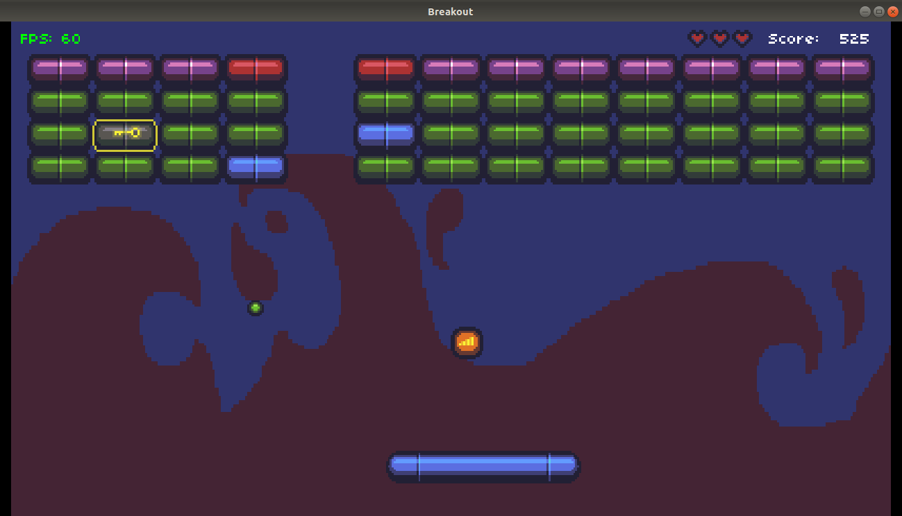
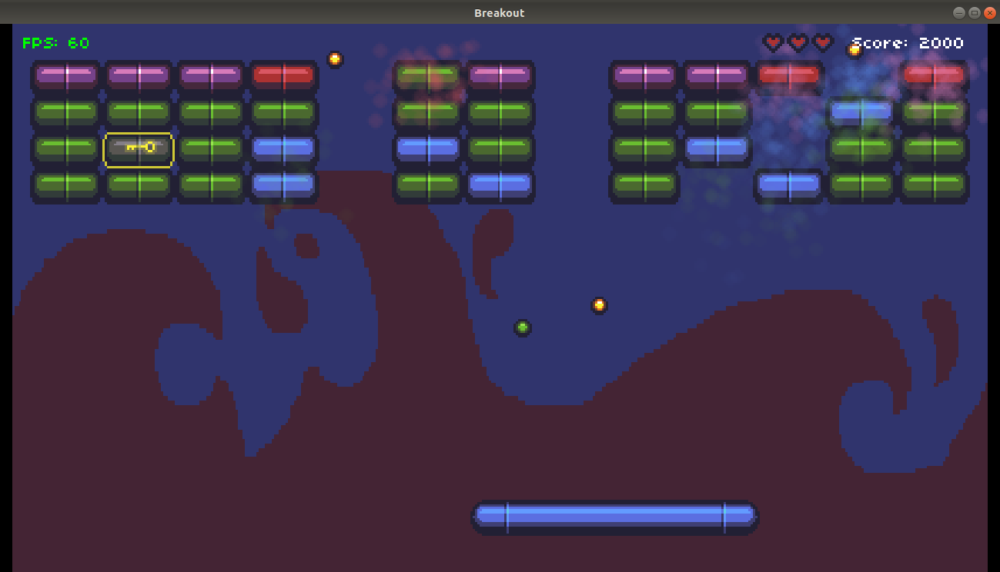
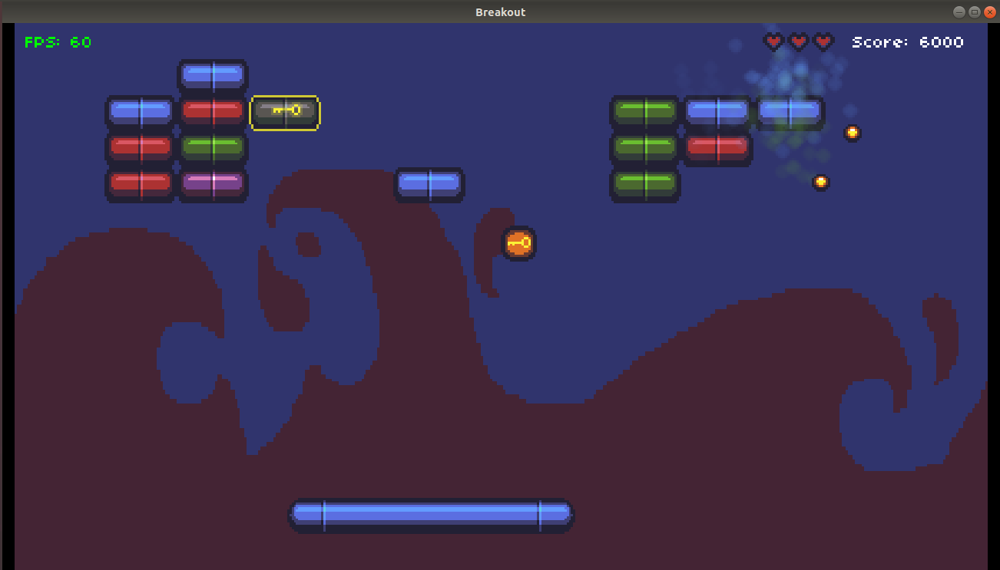
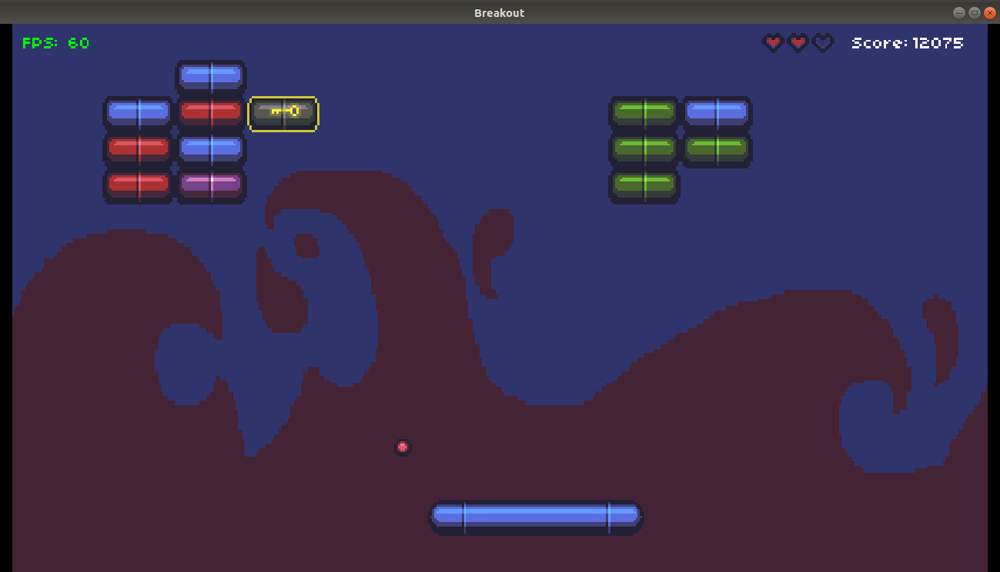
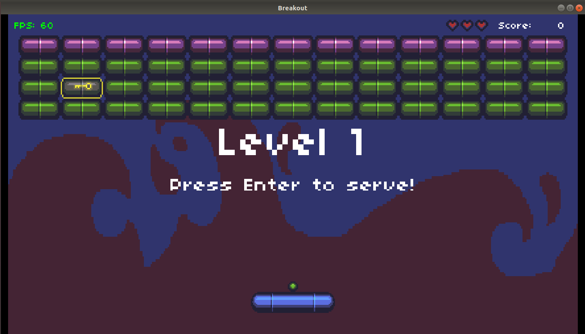
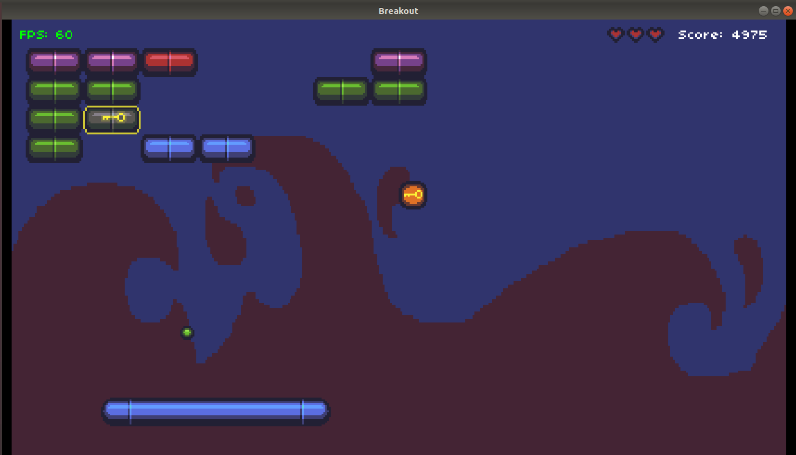

# Breakout

Hello visitor! 
Assignment 2 is divided into 3 sub tasks, so I've shared the screenshots of the final game which perfectly addresses those subtasks.

<b>1. Spawns a powerup balls</b> 
Here, this yellow item falls downwards and when collided with paddle, spawns 3 balls as seen in the next picture. 

 

 
Note : Here, in the previous two images you can see that as the player gathers more scores, the paddle size increases.
 

<b>2. Grow and shrink the Paddle</b> 
Here, in the next two images you can see that as the player looses health point, the paddle size decreases.

 

 

<b>3. Add a locked Brick</b> 
Here, in the next two images you see locked brick and key Powerup respectively. 

 

 
